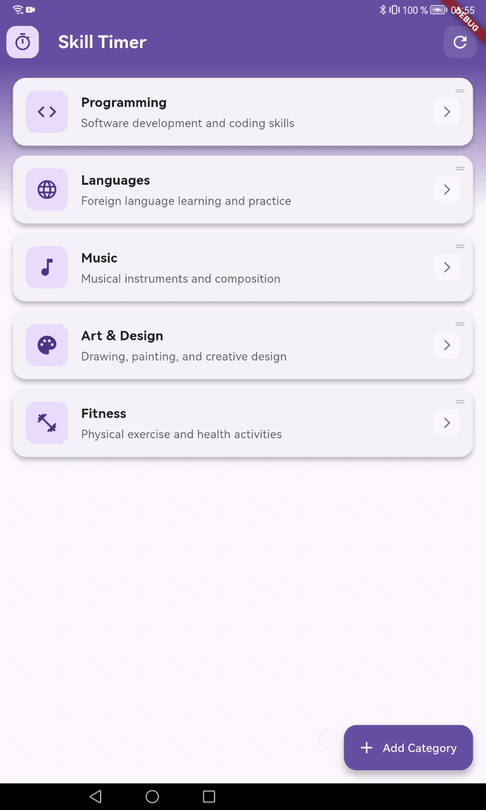

# Skill Timer
Heard of a 10000 hours rule? To become a master of a skill you should practice it for 10,000 hours. This app will help you track the time you spent on a skill.

Create or select a skill, like "Learning Japanesse", press a timer button and do some practice. When done, save the session to add to overall time.

